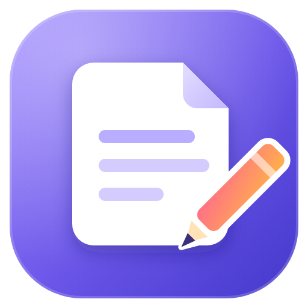
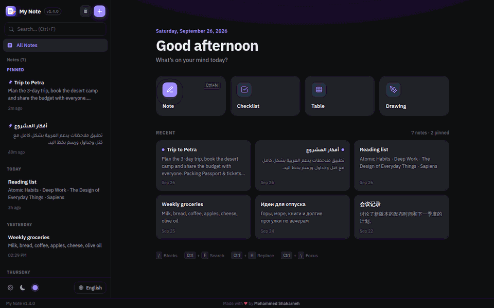
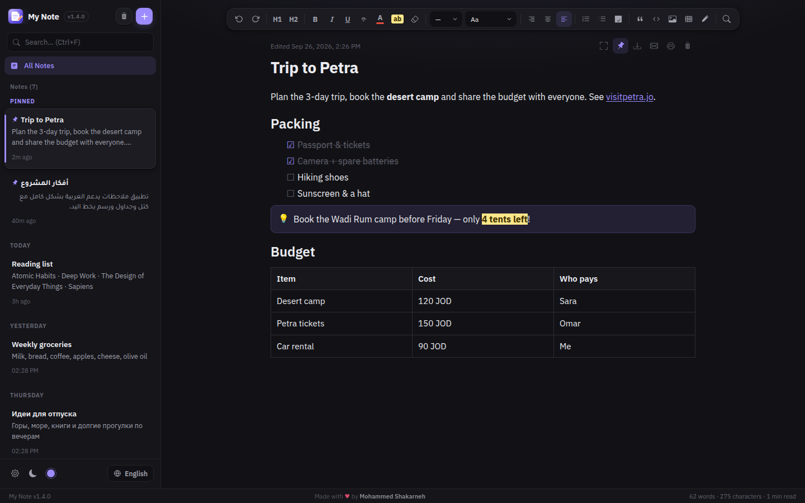
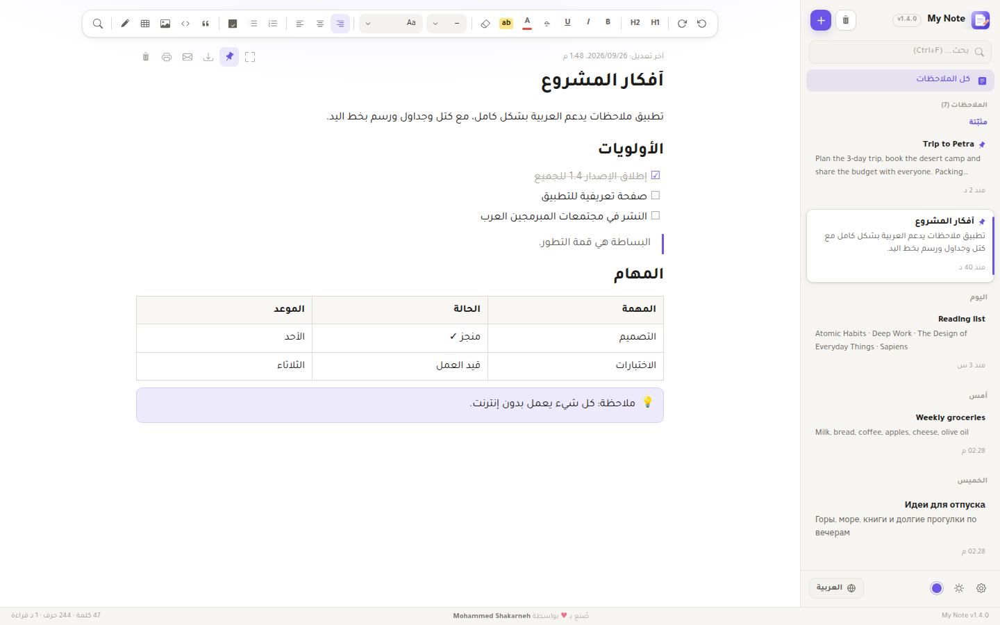
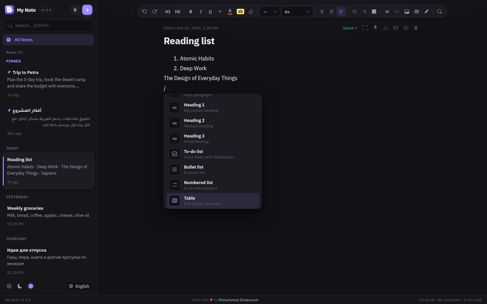
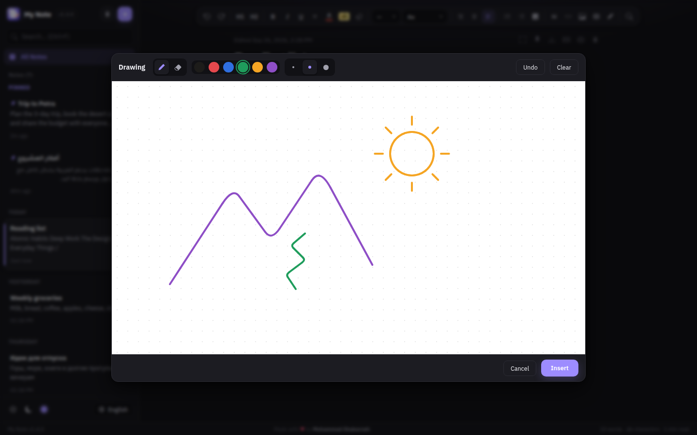
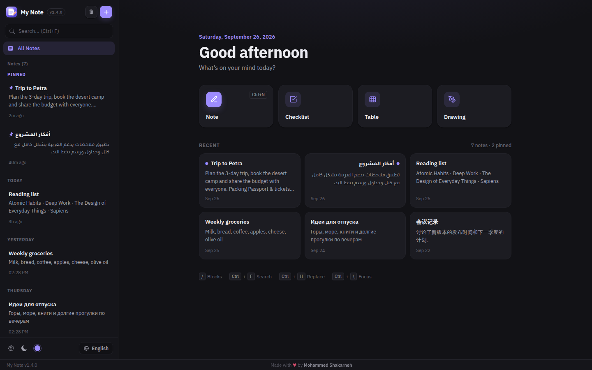
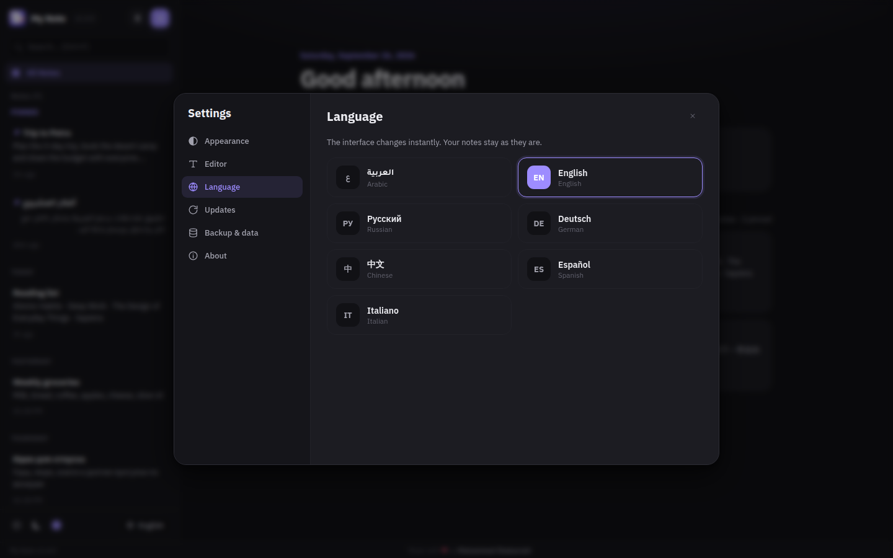

<p align="center"></p>

<h1 align="center">My Notes</h1>

<p align="center">
  <b>Beautiful notes for Windows — blocks, tables, drawings and automatic updates.</b><br>
  Built for Arabic (RTL) from day one, and speaks English, Русский, Deutsch, 中文, Español and Italiano too.
</p>

<p align="center" dir="rtl">
  تطبيق ملاحظات جميل لويندوز يدعم العربية بالكامل — كتل، جداول، رسم بخط اليد، وتحديث تلقائي. مجاني ويعمل بدون إنترنت.
</p>

<p align="center">
  <a href="https://github.com/Shakarneh/My-Notes/releases/latest"></a>
  <a href="https://github.com/Shakarneh/My-Notes/releases"></a>
  
  
</p>

<p align="center">
  <a href="https://github.com/Shakarneh/My-Notes/releases/latest"><b>⬇️ Download for Windows</b></a>
  &nbsp;·&nbsp;
  <a href="https://shakarneh.github.io/My-Notes/">Website</a>
  &nbsp;·&nbsp;
  <a href="https://github.com/Shakarneh/My-Notes/issues/new/choose">Report a bug / suggest a feature</a>
</p>

<p align="center"></p>

## Screenshots

| | |
|---|---|
|  |  |
| **Rich notes** — headings, to-dos, callouts, tables | **Arabic first** — every line picks its own direction |
|  |  |
| **Type `/`** to insert any block | **Draw** by hand, right inside a note |
|  |  |
| **Home** — quick create and recent notes | **Settings** — 7 languages, themes, editor options |

## Download

👉 [Download the latest version](https://github.com/Shakarneh/My-Notes/releases/latest) — run the installer and you're done. The app keeps itself up to date.

## Features

### Writing
- **Block editing** — type `/` anywhere to insert a heading, to-do list, table, callout, quote, code block, divider, image, drawing, today's date or the time. The menu understands Arabic, English and Russian (`/جدول`, `/table`, `/таблица`).
- **Markdown shortcuts** — `#`, `##`, `###` for headings, `-` or `*` for bullets, `1.` for numbers, `[]` for to-dos, `>` for quotes, `!!` for a callout, ```` ``` ```` for code and `---` for a divider.
- **Tables** — insert a grid, then add or remove rows and columns from the table toolbar.
- **Drawings** — sketch with a mouse or pen (pressure-sensitive) and drop the drawing straight into your note.
- **Rich text** — bold, italic, underline, strikethrough, text colour, highlight, font size and family, alignment, clear formatting, undo/redo.
- **Images** — insert, paste or drag-and-drop images; very large pictures are resized automatically so notes stay fast.
- **Links** — web addresses and e-mail addresses become links as you type; `Ctrl` + click opens them.
- **Find & replace** inside a note (`Ctrl+H`) — ignores Arabic diacritics, so "مدرسة" also finds "مَدْرَسَة".

### Languages & RTL
- Seven interface languages: العربية, English, Русский, Deutsch, 中文, Español, Italiano — switch instantly from the sidebar or Settings.
- Every paragraph picks its own direction automatically, so Arabic and English can live in the same note.
- Alignment buttons, lists, check-boxes, quotes, callouts and tables all behave correctly right-to-left.

### Organising
- **Home screen** with a greeting, quick-create tiles (note, checklist, table, drawing) and your recent notes.
- **Pin** important notes to the top; **duplicate** notes; notes are grouped by date.
- **Smart search** — case-insensitive in every language, ignores Arabic diacritics and letter variants (أ/إ/آ → ا, ة → ه, ى → ي), and highlights matches.
- **Trash with undo** — deleted notes can be restored instantly from the toast, or from the Trash for 90 days.

### Sharing & safety
- **Export** a note to `.txt` or `.html`, **print** it, or **send it by e-mail**.
- **Backup** all notes to a single JSON file and **import** them back on any computer (imports never overwrite existing notes).
- Autosave — with a clear *Saving… / Saved ✓* indicator — and `Ctrl+S` to save immediately.

### Settings (`Ctrl+,`)
- Theme, accent colour and reduced motion; note text size, page width, line spacing and font; spell check; language; automatic updates; backup and data folder.

### Automatic updates
- The app checks for new versions on start-up and every few hours, downloads them in the background (verified with SHA-256), and installs with one click on **Restart & update**.
- After updating, a **What's new** screen shows off the new features.
- A release can be marked as **required** — users then can't keep using an old version.

### Look & feel
- Light, dark or automatic theme (by time of day) and six accent colours.
- **Focus mode** (`Ctrl+\`) hides everything but your writing.
- Word count, character count and reading time for every note.
- Works completely offline — fonts and the editor are bundled, no internet needed.

## Keyboard shortcuts

| Shortcut | Action |
| --- | --- |
| `Ctrl+N` | New note |
| `Ctrl+F` | Search all notes |
| `Ctrl+H` | Find & replace in the note |
| `Ctrl+S` | Save now |
| `Ctrl+\` | Focus mode |
| `Ctrl+,` | Settings |
| `/` | Insert a block |
| `Ctrl+Z` / `Ctrl+Y` | Undo / redo |
| `Esc` | Close search, menus and focus mode |

Shortcuts work on Arabic and Russian keyboard layouts too.

## Requirements

- Windows 10 or later (64-bit)
- No internet connection required
- No installation of Python or any other software needed

## Installation

1. Download `MyNotes-Setup-v1.4.0.exe` from the [Releases page](https://github.com/Shakarneh/My-Notes/releases)
2. Run the installer and follow the steps
   (if Windows shows *"Windows protected your PC"*, click **More info → Run anyway** — the app is new and not yet code-signed)
3. Launch **My Notes** from the desktop shortcut or Start Menu

The app keeps itself up to date automatically.

## Running from source

```powershell
python -m venv .venv
.venv\Scripts\pip install -r requirements.txt
.venv\Scripts\python main.py
```

Notes are stored in `%APPDATA%\NotesApp\notes.db`.
Run the tests with `python -m unittest discover tests`.

## Publishing an update

Releases are built in the cloud by GitHub Actions — no Windows build machine needed.

1. Merge your changes into `main`.
2. On GitHub open **Actions → Build & Release → Run workflow** (branch `main`).
3. Enter the new **version** (e.g. `1.4.0`) and the **release notes** — one `- item` per line.
   Add `[required]` anywhere in the notes to force every user to update.
4. Click **Run workflow**. It bumps the version, tags it, builds the installer and publishes the GitHub Release.

Every installed copy of My Notes finds the release on its next check, downloads it in the background and offers **Restart & update**. New users always get the latest version from the download link above.

After a release, update the [winget](https://learn.microsoft.com/windows/package-manager/) listing with
`wingetcreate update Shakarneh.MyNotes --version X.Y.Z --urls <installer-url> --submit` (the first submission uses the manifests in `winget/`).

Every push to any branch also builds the installer — download it from the run's **Artifacts** to test before releasing. (`release.ps1` still works for building locally on Windows.)

## Built With

- [Python](https://www.python.org/) — backend logic
- [PyWebView](https://pywebview.flowrl.com/) — native desktop window
- [Quill.js](https://quilljs.com/) — rich text editor (bundled)
- [SQLite](https://www.sqlite.org/) — local database
- [Tajawal](https://fonts.google.com/specimen/Tajawal) and [IBM Plex Sans](https://fonts.google.com/specimen/IBM+Plex+Sans) fonts (SIL Open Font License, bundled)

## Author

**Mohammed Shakarneh**
GitHub: [@Shakarneh](https://github.com/Shakarneh)
